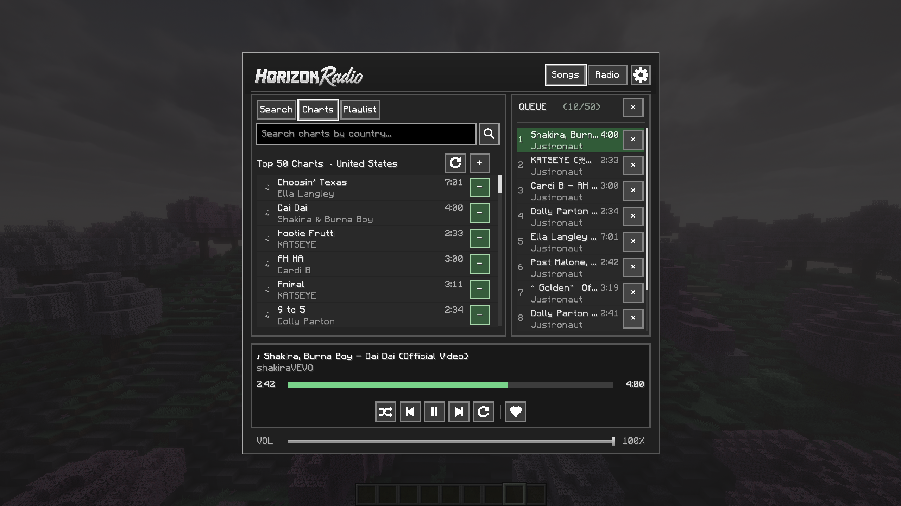

<p align="center">
  
</p>

# Your Minecraft world. Your soundtrack.

**HorizonRadio brings YouTube music and live internet radio into Minecraft 1.7.10.**
Find a song, discover a playlist, or tune in to a station without leaving the game.
Build a shared queue with friends and let the music follow your next mining trip,
factory expansion, or evening at the base.

Made for **Forge 1.7.10**, with **GregTech: New Horizons** as an intended target.
No GregTech or GTNHLib dependency, no extra blocks or recipes, and no external
media program to install.

[Download the latest release](https://github.com/Justronaut716/HorizonRadio/releases/latest)
 · [Report a problem](https://github.com/Justronaut716/HorizonRadio/issues)

## What you can do

| Feature | In the game |
| --- | --- |
| **Find your next song** | Search YouTube, open video links, discover playlists, and import their tracks. |
| **Explore the charts** | Browse weekly Top 50 songs by country; search regions using names or ISO codes such as `Deutschland`, `Germany`, or `DE`. |
| **Listen together** | Add songs to the shared server queue, drag them into order, or play a selected track immediately. Song playback follows the server's shared timeline. |
| **Tune in to live radio** | Browse and search Radio Browser stations, then start their live streams directly in Minecraft. |
| **Keep your favorites close** | Save favorite songs and stations locally for quick access. |
| **Control the soundtrack** | Use play/pause, previous/next, shuffle, repeat, seeking, and your own volume slider for songs. Live radio has play/stop controls. |
| **Stay informed** | In-game notifications show queue activity and playback feedback; settings let you adjust the interface and notifications. |
| **Manage your server** | Operators can change queue size and maximum song duration from the in-game settings panel. |

The interface keeps discovery and the queue side by side, with playback controls
always within reach. Each player controls their own volume; audio is downloaded
and decoded on each client, while the server coordinates the shared queue.

## Screenshots

**Charts, shared queue, and playback controls — all in one screen.**



**Now-playing notifications keep you updated while you play.**


## Get started

1. Install **Minecraft 1.7.10 with Forge 10.13.4.1614**.
2. Download `horizonradio-1.0.0.jar` from the
   [releases page](https://github.com/Justronaut716/HorizonRadio/releases).
3. Put the same JAR in the server's and every player's `mods` folder. For a local
   world, install it in your client's `mods` folder. Use the plain JAR.
4. Join a world and press **N** to open HorizonRadio.
5. Search for music in **Songs**, explore **Charts** or **Playlists**, or switch
   to **Radio** to choose a station. Add favorites and build your queue.

Each client needs internet access to the media services it uses and a working
Java Sound device. The server does not need to connect to YouTube or radio
stations and does not relay audio. The media decoders are included in the JAR.

**Runtime targets:** ordinary Forge with a Java 8-compatible runtime, and GTNH
with Java 17 or newer. These are intended targets; standalone Forge and GTNH
runtime smoke tests are still pending. See the
[compatibility notes](docs/COMPATIBILITY.md) for verification details.

## Settings and storage

Open the in-game settings panel to customize interface preferences and
notifications. Server operators also have **OP Settings** for queue capacity
and the maximum song duration. Defaults are **50 entries** and **15 minutes**;
changes apply to new entries, so reducing a limit keeps existing songs.

Server settings live in `config/horizonradio.json`. Personal volume is saved
in `config/horizonradio-client.json`. Songs are cached locally as WAV files in
`horizonradio-audio`; this temporary cache is cleared on client startup and exit
and pruned around the current playback position during a session.

## A few things to know

- Everyone needs the same mod version. The shared queue is kept in memory and
  does not survive a server restart.
- YouTube, Radio Browser, and station streams are external services; availability
  and playable tracks can vary.
- Each listener connects to live radio independently, so radio may have a small
  timing difference between players. Live streams cannot be paused or seeked.
- Downloading and decoding songs uses client bandwidth, memory, and disk space.
  Playback may take a moment to start on slower connections.
- Direct radio streams are supported; HLS/M3U8 playback is not supported.

## Build and contribute

Development and release builds require **Java 25** and use the included Gradle
wrapper. Java 25 is a build requirement, not the game's runtime requirement.

```bash
./gradlew build
```

This runs checks, tests, packaging audits, and JAR assembly. To build the release
version explicitly:

```bash
VERSION=1.0.0 ./gradlew spotlessCheck test packagingTest build
```

Install `build/libs/horizonradio-1.0.0.jar`; the `-dev` and `-sources` outputs are
for development. Run `./gradlew clean` separately if you need a fresh build.

Further reading: [release guide](docs/RELEASE.md),
[architecture](docs/ARCHITECTURE.md), and
[compatibility and test evidence](docs/COMPATIBILITY.md).
